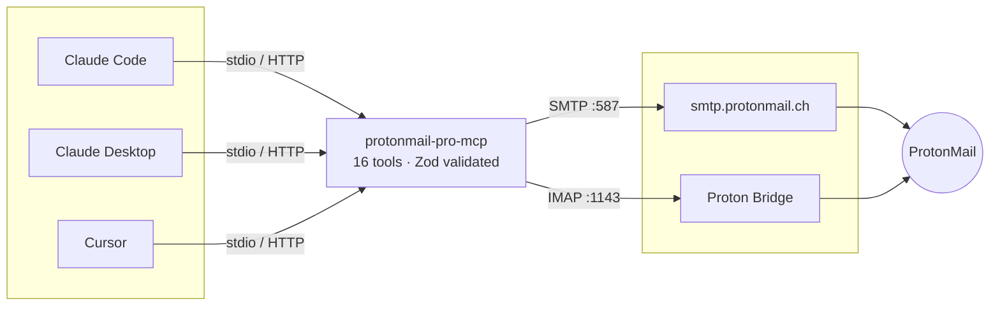
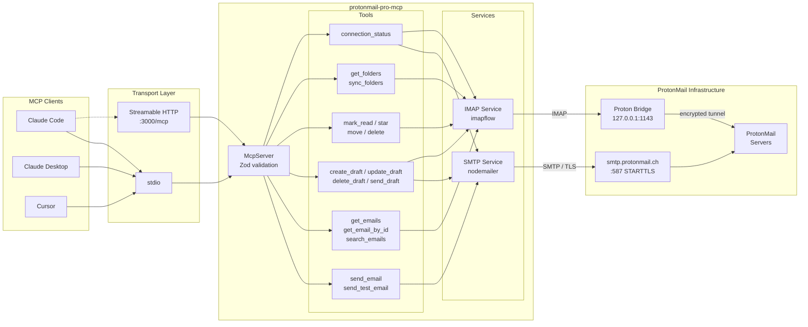

<div align="center">

# ProtonMail MCP Server

**Email management for AI agents through ProtonMail and Proton Bridge**

[](https://modelcontextprotocol.io)
[](https://www.typescriptlang.org)
[](https://opensource.org/licenses/MIT)
[](https://nodejs.org)

Send, read, search, and organize emails from Claude Code, Claude Desktop, Cursor, or any MCP-compatible client.



</div>

---

## Quick start

```bash
git clone https://github.com/ronamosa/protonmail-pro-mcp.git
cd protonmail-pro-mcp
npm install
npm link
```

Verify the install:

```bash
which protonmail-pro-mcp
```

> **Prerequisites** -- [Node.js](https://nodejs.org) >= 18 and [Proton Bridge](https://proton.me/mail/bridge) running locally.

## Configuration

```bash
cp .env.example .env   # then fill in your credentials
```

| Variable | Required | Default | Description |
|:---------|:--------:|:-------:|:------------|
| `PROTONMAIL_USERNAME` | Yes | -- | Your ProtonMail email address |
| `PROTONMAIL_PASSWORD` | Yes | -- | Proton Bridge password (not your login password) |
| `PROTONMAIL_SMTP_HOST` | | `smtp.protonmail.ch` | SMTP server host |
| `PROTONMAIL_SMTP_PORT` | | `587` | SMTP server port |
| `PROTONMAIL_IMAP_HOST` | | `127.0.0.1` | IMAP host (Proton Bridge) |
| `PROTONMAIL_IMAP_PORT` | | `1143` | IMAP port (Proton Bridge) |
| `PROTONMAIL_IMAP_TLS` | | `false` | Enable TLS for IMAP |
| `PORT` | | `3000` | HTTP transport port |
| `DEBUG` | | `false` | Enable debug logging |

> **Security** -- `PROTONMAIL_PASSWORD` is the bridge-generated password, not your ProtonMail login. Never commit `.env` files.

## Usage

<details>
<summary><strong>Claude Code</strong></summary>

Add to `~/.claude.json` under `mcpServers`, or run `claude mcp add`:

```json
{
  "mcpServers": {
    "protonmail": {
      "type": "stdio",
      "command": "protonmail-pro-mcp",
      "env": {
        "PROTONMAIL_USERNAME": "you@protonmail.com",
        "PROTONMAIL_PASSWORD": "your-bridge-password"
      }
    }
  }
}
```

</details>

<details>
<summary><strong>Claude Desktop</strong></summary>

Add to `~/.config/claude/claude_desktop_config.json`:

```json
{
  "mcpServers": {
    "protonmail": {
      "command": "protonmail-pro-mcp",
      "env": {
        "PROTONMAIL_USERNAME": "you@protonmail.com",
        "PROTONMAIL_PASSWORD": "your-bridge-password"
      }
    }
  }
}
```

</details>

<details>
<summary><strong>Cursor</strong></summary>

Add to `.cursor/mcp.json` in your project:

```json
{
  "mcpServers": {
    "protonmail": {
      "command": "protonmail-pro-mcp",
      "env": {
        "PROTONMAIL_USERNAME": "you@protonmail.com",
        "PROTONMAIL_PASSWORD": "your-bridge-password"
      }
    }
  }
}
```

</details>

<details>
<summary><strong>HTTP transport (remote deployment)</strong></summary>

```bash
protonmail-pro-mcp --transport http --port 3000
```

Endpoints: `POST /mcp`, `GET /mcp`, `DELETE /mcp` (Streamable HTTP). Health check at `GET /health`.

</details>

## Tools

| | Tool | Description |
|:--|:-----|:------------|
| **Send** | `send_email` | Send with to/cc/bcc, HTML, priority, reply-to, attachments |
| | `send_test_email` | Quick test email to verify SMTP |
| **Read** | `get_emails` | Fetch from a folder with pagination |
| | `get_email_by_id` | Full email with body and headers |
| | `search_emails` | Filter by from, to, subject, date, flags, attachments |
| **Drafts** | `create_draft` | Create a new draft in the Drafts folder |
| | `update_draft` | Replace an existing draft with new content |
| | `delete_draft` | Delete a draft |
| | `send_draft` | Send a draft via SMTP and remove it from Drafts |
| **Act** | `mark_email_read` | Mark read or unread |
| | `star_email` | Star or unstar |
| | `move_email` | Move between folders |
| | `delete_email` | Soft-delete to Trash; permanent only if already in Trash |
| **Folders** | `get_folders` | List all folders with message counts |
| | `sync_folders` | Force-refresh folder list |
| **System** | `get_connection_status` | SMTP and IMAP connection health |

## Architecture



<details>
<summary><strong>Project structure</strong></summary>

```
src/
  index.ts            Entry point, transport selection, graceful shutdown
  server.ts           McpServer setup, tool registration
  config.ts           Zod-validated environment configuration
  logger.ts           Structured stderr logger with credential redaction
  types.ts            Shared TypeScript interfaces
  services/
    smtp.ts           nodemailer wrapper (lazy connection)
    imap.ts           imapflow + mailparser wrapper (lazy connection, auto-reconnect)
  tools/
    sending.ts        send_email, send_test_email
    reading.ts        get_emails, get_email_by_id, search_emails
    drafts.ts         create_draft, update_draft, delete_draft, send_draft
    actions.ts        mark_email_read, star_email, move_email, delete_email
    folders.ts        get_folders, sync_folders
    system.ts         get_connection_status
```

</details>

<details>
<summary><strong>Design decisions</strong></summary>

- **McpServer API** (SDK v1.29+) with Zod input validation on every tool
- **Tool annotations** (`readOnlyHint`, `destructiveHint`, `openWorldHint`) per MCP spec
- **Dual transport** -- stdio for local use, Streamable HTTP for remote deployment
- **Lazy connections** -- SMTP and IMAP connect on first use, not at startup
- **Credential redaction** -- passwords scrubbed from all log output
- **Soft delete** -- `delete_email` moves to Trash first; permanent delete only from Trash

</details>

## Development

```bash
npm run dev          # Watch mode with tsx
npm run typecheck    # Type checking without emit
npm run lint         # ESLint
npm run format       # Prettier
npm test             # Run tests
npm run build        # Rebuild (symlink picks up changes automatically)
```

## Credits

Originally scaffolded from [anyrxo/protonmail-pro-mcp](https://github.com/anyrxo/protonmail-pro-mcp). Completely rewritten with modern MCP SDK, Zod validation, dual transport, and full tool implementations.

## License

MIT
